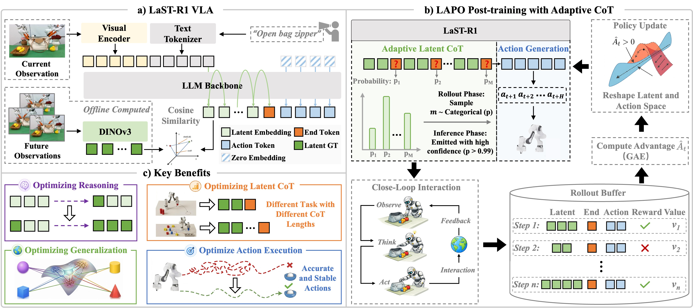
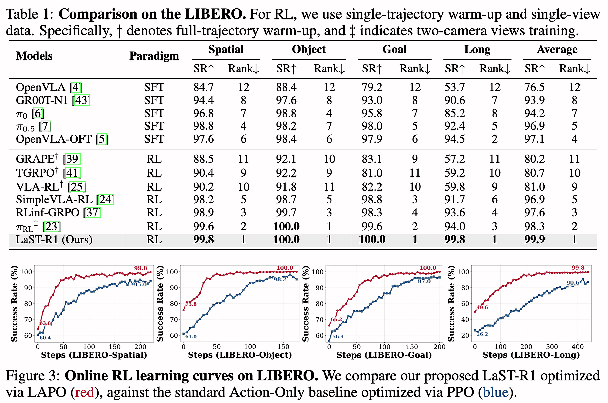

<div align="center">

# LaST-R1: Reinforcing Robotic Manipulation via Adaptive Physical Latent Reasoning

<a href="https://siriyep.github.io/last-r1/"></a> &ensp;
<a href="https://arxiv.org/pdf/2604.28192"></a> &ensp;
<a href="https://huggingface.co/chenhao01/LaST-R1/tree/main"></a> &ensp;

Hao Chen, Jiaming Liu, Zhonghao Yan, Nuowei Han, Renrui Zhang, Chenyang Gu, Jialin Gao, Ziyu Guo, Siyuan Qian, Yinxi Wang, Peng Jia, Shanghang Zhang, Pheng-Ann Heng



<div align="left">

**🤖The Framework of LaST-R1.** (a) LaST-R1 VLA is a unified model that takes visual observations and language instructions as input, where a vision foundation model provides physically grounded latent targets to guide latent CoT reasoning before action generation. (b) During LAPO RL post-training, LaST-R1 interacts with the environment in a closed loop manner, storing latents, actions, and rewards in a rollout buffer for jointly reshaping the latent and action spaces. It further enables adaptive reasoning by learning to emit the `<latent_end>` token based on predicted probabilities, dynamically adjusting the reasoning horizon across tasks. (c) Through LAPO, LaST-R1 achieves adaptive reasoning lengths across diverse tasks, improving generalization and execution stability.

</div>

</div>

## 🔥 News

- [2026/05/06] LaST-R1 is now live on arXiv! The code and model checkpoints are both open source! 🚀 

## 📦 Installation

The code is built using Python 3.10, we also recommand to use Python above Python 3.10. We require PyTorch >= 2.2.0 and CUDA >= 12.0 (It may run with lower versions, but we have not tested it).
We recommend using [Miniconda](https://docs.conda.io/en/latest/miniconda.html) and create an environment as follows:

```bash
conda create -n last-r1 python=3.10 -y
conda activate last-r1

pip install torch==2.5.1 torchvision==0.20.1 torchaudio==2.5.1 --index-url https://download.pytorch.org/whl/cu124
pip install -r requirements.txt

# Clone veRL (recommended to place at the same level as LaST-R1, not inside the LaST-R1 folder)
git clone -b v0.2.x https://github.com/volcengine/verl.git
cd /path/to/verl
# Replace the installed pyproject.toml file with our custom ./setup/pyproject.toml file.
pip install -e .

# Clone LIBERO (recommended to place at the same level as LaST-R1, not inside the LaST-R1 folder)
git clone https://github.com/Lifelong-Robot-Learning/LIBERO.git
cd /path/to/LIBERO
pip install -e .
```

## 🧩 Framework

Our code is built based on [Qwen3-VL](https://github.com/QwenLM/Qwen3-VL) and [veRL](https://github.com/verl-project/verl), organized in the following framework:

- `verl/trainer/main_ppo.py`: LAPO training entry point that initializes the trainer and launches the training pipeline
- `verl/trainer/config/ppo_trainer.yaml`: default LAPO training configuration (data, optimization, rollout, logging, and runtime settings)
- `verl/trainer/ppo/ray_trainer.py`: coordinates distributed training, including rollout, reward/advantage computation, and actor updates
- `verl/trainer/ppo/core_algos.py`: core LAPO utilities and algorithm logic used by the trainer (e.g., advantage/return and policy optimization helpers)
- `verl/workers/rollout/rob_rollout.py`: handles environment interaction, trajectory collection, and action generation during rollout
- `verl/workers/fsdp_workers.py`: defines FSDP-based worker abstractions for distributed model execution and training/inference worker behaviors
- `verl/workers/actor/dp_rob.py`: actor-side training logic, including loss computation, value prediction, and policy updates
- `verl/workers/actor/action_tokenizer.py`: converts continuous robot actions to discrete tokens and back
- `transformers/models/qwen3_vl/modeling_qwen3_vl.py`: core Qwen3-VL model implementation, including latent/action modeling and value head integration
- `transformers/integrations/sdpa_attention.py`: SDPA attention integration and attention-mask related logic

## 💡 Usage
### 🔍 Prepare Warmup SFT Model

We release all LIBERO warmup SFT models and post-RL models on [Huggingface 🤗](https://huggingface.co/) as follows:
- [last-r1-warmup-libero_spatial-oneshot](https://huggingface.co/chenhao01/LaST-R1/tree/main/LaST-R1-Warmup/last-r1-warmup-libero_spatial-oneshot) | [last-r1-rl-libero_spatial](https://huggingface.co/chenhao01/LaST-R1/tree/main/LaST-R1-RL/last-r1-rl-libero_spatial)
- [last-r1-warmup-libero_object-oneshot](https://huggingface.co/chenhao01/LaST-R1/tree/main/LaST-R1-Warmup/last-r1-warmup-libero_object-oneshot) | [last-r1-rl-libero_object](https://huggingface.co/chenhao01/LaST-R1/tree/main/LaST-R1-RL/last-r1-rl-libero_object)
- [last-r1-warmup-libero_goal-oneshot](https://huggingface.co/chenhao01/LaST-R1/tree/main/LaST-R1-Warmup/last-r1-warmup-libero_goal-oneshot) | [last-r1-rl-libero_goal](https://huggingface.co/chenhao01/LaST-R1/tree/main/LaST-R1-RL/last-r1-rl-libero_goal)
- [last-r1-warmup-libero_10-oneshot](https://huggingface.co/chenhao01/LaST-R1/tree/main/LaST-R1-Warmup/last-r1-warmup-libero_10-oneshot) | [last-r1-rl-libero_10](https://huggingface.co/chenhao01/LaST-R1/tree/main/LaST-R1-RL/last-r1-rl-libero_10)


### 🔍 Training and Evaluation on LIBERO
1. The main training and evaluation script is `scripts/run_libero_rl_training.sh`. When editing this script, please pay attention to:
    - `SFT_MODEL_PATH` (warm-up model checkpoint path), `DATA_STATUS` (dataset statistics `.json` used for action normalization), and `ALIGN_PATH` (runtime environment `align.json` config) must be valid paths.
    - `VAL_ONLY` controls train/eval mode: set `VAL_ONLY=False` for training and `VAL_ONLY=True` for evaluation.
    - `DATASET_NAME` should match your benchmark split (`libero_spatial`, `libero_object`, `libero_goal`, or `libero_10`), and related parameters (e.g., `max_prompt_length`, `traj_mini_batch_size`, and `*_max_steps`) should be updated consistently.
    - `NUM_GPUS` affects several effective batch settings (e.g., `actor.ppo_micro_batch_size=$NUM_GPUS` and recommended `val_batch_size`); if you change GPU count, adjust batch sizes accordingly to avoid OOM or shape mismatches.

2. Hardware-specific initialization note: in `verl/workers/rollout/rob_rollout.py`, function `env_worker(...)` (around lines 315-316), we apply `initial_state[12] += 0.038` for `libero_spatial` task 5 to avoid environment initialization failure observed on NVIDIA H20 machines. If your hardware does not show this issue, you may remove this workaround based on your setup.


3. We evaluate **LaST-R1** on [LIBERO](https://libero-project.github.io/main.html) and achieve state-of-the-art performance.



## 📜️ License

This project is licensed under the MIT License - see the [LICENSE](LICENSE) file for details.

## 📚 BibTeX
```bibtex
@article{chen2026last,
  title   = {LaST-R1: Reinforcing Action via Adaptive Physical Latent Reasoning for VLA Models},
  author  = {Chen, Hao and Liu, Jiaming and Yan, Zhonghao and Han, Nuowei and Zhang, Renrui and Gu, Chenyang and Gao, Jialin and Guo, Ziyu and Qian, Siyuan and Wang, Yinxi and others},
  journal = {arXiv preprint arXiv:2604.28192},
  year    = {2026}
}
```
